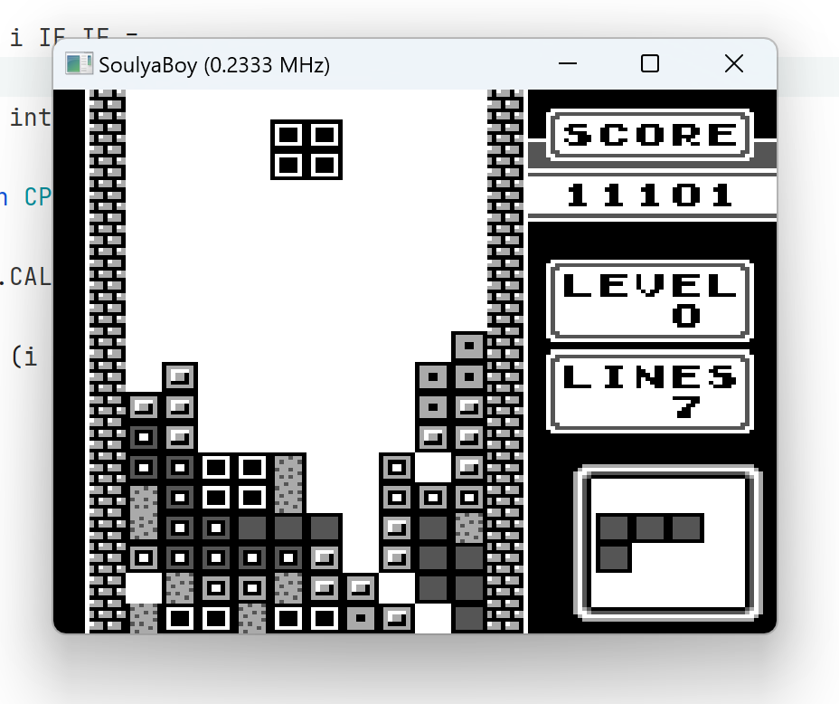

# Soul~~ja~~yaBoy

A Gameboy emulator written in F#.

## Great Reference Material Used

* [Functional Programming Design Patterns](https://fsharpforfunandprofit.com/fppatterns/)
* [Game Boy TM CPU Manual](http://marc.rawer.de/Gameboy/Docs/GBCPUman.pdf)
* [Pan Docs](https://gbdev.io/pandocs/)
* [Game Boy: Complete Technical Reference](https://gekkio.fi/files/gb-docs/gbctr.pdf)
* And more found from [Awesome Game Boy Development](https://github.com/gbdev/awesome-gbdev)
